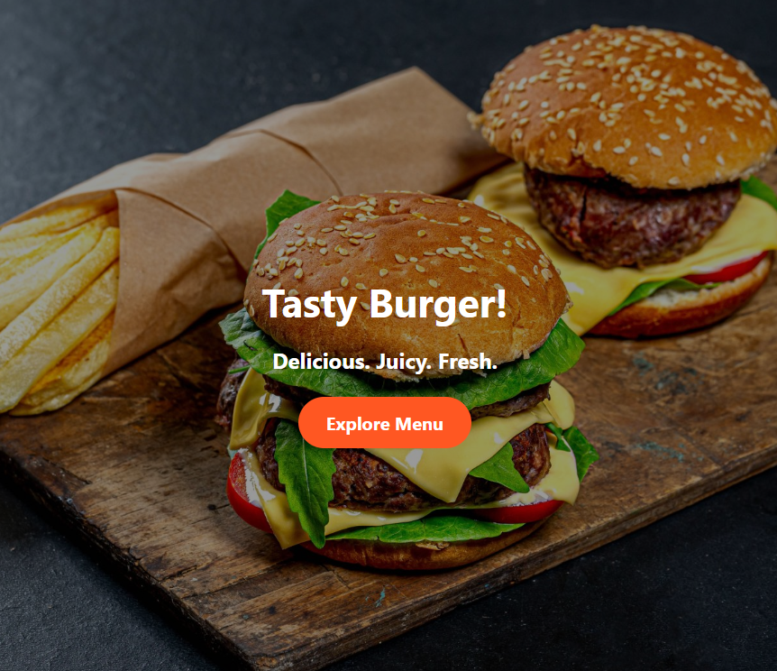
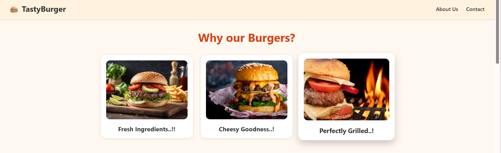
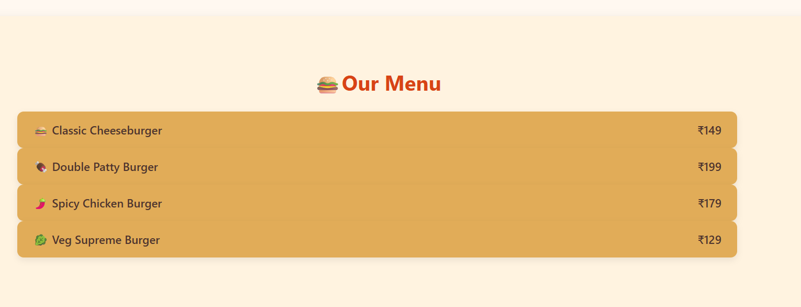

# E-landingpage
# 🍔 Tasty Burgers - Landing Page

This is a simple and attractive landing page project for a fictional burger restaurant named **Tasty Burgers**. The goal is to create a visually appealing website using only HTML and CSS.

## 🔧 Technologies Used
- HTML5
- CSS3

## 📁 Files
- `index.html` - Main HTML structure
- `style.css` - All the styling and layout
- External image links used (no images folder needed)

## 📸 Features
- Smooth and clean UI design
- "Why our Burgers?" section with cards
- Stylish burger menu
- Navigation links: About Us, Contact
- Mobile responsive *(planned / in progress)*

## 🚀 How to Run
1. Clone the repo or download the files.
2. Open `index.html` in your browser.

## 📸 Preview

### 🏠 Home Section

### 🍔 Burger Cards & Menu

Built with ❤️ for learning frontend development.

